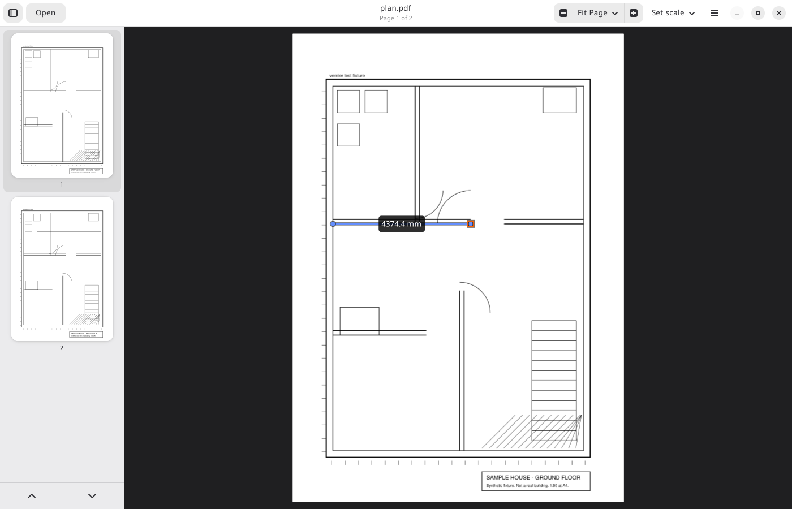

# Vernier

Measure lengths on PDF drawings, with the cursor snapping to the drawing's own
vector geometry.



Architectural and engineering PDFs exported from CAD still contain the real
line work. Vernier reads it, indexes every vertex, and snaps your clicks to
them, so a measurement means the same thing it meant in the model rather than
whatever pixel you happened to hit. Set the scale once, from the plot ratio
printed on the sheet or from any dimension you already know, and read lengths
in millimetres, metres, feet or inches.

The name is from the vernier scale, the sliding scale that lets a ruler be read
precisely.

## Use it

- **[Measure your first drawing](docs/tutorial.md)**: a short walk-through on the
  sample plan.
- **[Controls and readouts](docs/controls.md)**: every control, the scale syntax,
  what the numbers mean.

Vernier is packaged as a Flatpak (`io.github.genneth.Vernier`) and is being
submitted to Flathub; see [packaging](packaging/README.md) to build and install
it locally in the meantime.

## Build from source

Rust stable plus the GTK stack: GTK4 ≥ 4.14, libadwaita ≥ 1.5, and for MuPDF's
build clang, cmake and the fontconfig and freetype headers. On Fedora:
`gtk4-devel libadwaita-devel clang-devel cmake fontconfig-devel freetype-devel`.

```sh
cargo build --release
cargo run --release -- drawing.pdf
cargo test
```

## Where things are

- [`docs/`](docs/README.md): user guide, architecture, developer how-tos.
- [`crates/core`](crates/core): the headless core (PDF, geometry, snapping,
  scale, tools). [`crates/app`](crates/app): the GTK4/libadwaita shell.
- [`packaging/`](packaging/README.md): Flatpak manifest, metainfo, release
  procedure.
- [`AGENTS.md`](AGENTS.md): working rules for contributors and coding agents.

## Status

Two-point length measurement with vertex snapping is complete and in daily use
on multi-thousand-segment plans. Not yet: areas and perimeters, counts,
midpoint and intersection snaps, saving measurements, export.

## Licence

AGPL-3.0-or-later. Vernier renders with [MuPDF](https://mupdf.com/), which is
AGPL; that dependency is confined to one module (`crates/core/src/pdf`).
